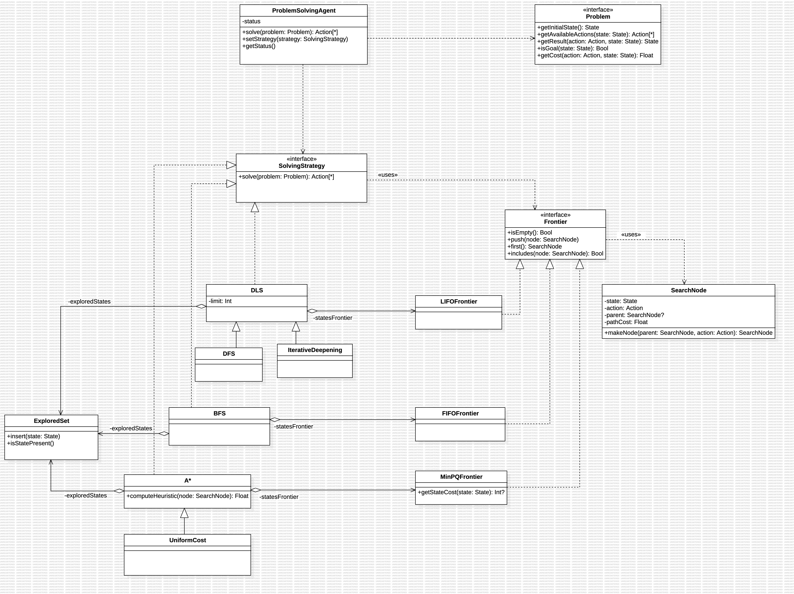

# ZTronProblemSolver

ZTronProblemSolver is part of the ZombieTron/Core packages suite. It defines a general framework to define and solve search problems. For theoretical aspects and optimality guarantees of the solution, please refer to [Fundamentals of Artificial Intelligence. Thid Edition, Chapters 1-2](http://repo.darmajaya.ac.id/5272/1/Artificial%20Intelligence-A%20Modern%20Approach%20%283rd%20Edition%29%20%28%20PDFDrive%20%29.pdf).

The following package provides a general version of the algorithms introduced by Russell and Norvig. 

## UML



At the core of the framework are the concept of `State` and `Action`. A `State` represents a particular configuration of the domain during the search, while an `Action` is whatever allows to jump from one state to another.

In practice, `Problem` and the algorithms are dependant on generic `State: Hashable` (for caching purposes, see `UniformCost`), and `Action: Any`. 

A solution to a problem is an `[Action]` that represent the ordered sequence of the operations that led from the initial `State`, at index `0`, (root of the states graph) to a goal `State`, last index.


At first, the user of this package must define a problem. Defining a problem involves subclassing `Problem<State, Action>` (with concrete types for both generic templates) interface and overriding everyone of its methods appropriately for the problem to solve. Once a `Problem` is defined it will be enough for the user to instantiate a `ProblemSolvingAgent<State, Action>`, injecting a concrete instance of `Strategy`.

The available `Strategy` types are `BFS`, `DFS`, `DLS`, `IterativeDeepening`, `UniformCost`, `AStar` at the moment.

Once the `ProblemSolvingAgent` is instantiated, you can invoke `func solve(problem: Problem<State, Action>) throws -> [Action]?`, passing as parameter a concrete instance of the defined problem. Some of the strategies accept a cutoff, and when the cutoff is reached and a solution wasn't found, `.solve(_:)` throws. When there's no reachable solution from the initial `State`, `.solve(_:)` returns `nil`. 

###### Please note: 

1. Solving a search problem involves heavy computation. It is discouraged to invoke `.solve(_:)` from the main thread synchronously, since it's likely to freeze the user interface for some time (that depends on the device's performance).
2. When `State` is a reference type, or an array of reference types, `func getResult(action: Action, node: SearchNode<State, Action>) throws -> State` should be defined in a way that it doesn't modify `node.state` directly. When `State` is an array of reference types or a mutable reference type, a deep copy should be performed instead, modified, and then returned, otherwise, if it's an array of value types, a shallow copy suffices, Favour immutable types for `State` generic (refer to Joshua Bloch: Effective Java - Third Edition, Item #17).
3. When using `AStar`, the `heuristic: (SearchNode<State, Action>) -> Float` closure should be designed to produce its result in `O(1)` time with respect to the size of `$0.state`.

## Usage Example

Consider a scenario where four figures are presented to the user vertically, top to bottom. One number at a time can be increased by one circularly, as in the successor of 9 is 0. When increasing one figure, the previous one (if exists) and next one (if exists) are also increased by one. The goal is to reach the configuration (top to bottom) 6,4,7,2. 

Under this scenario, a state is an assignment of a figure for each slot, that is, an `[Int]` of length `4`. An action is reasonably an integer representing the position of the next number to increase (`0`: top, `1`: second from top, `2`: second from bottom, `3`: bottom). The search `Problem` could be reasonably defined as follows:

```
class LighthouseDialsProblem: Problem<[Int], Int> {
    
    private var initialState: [Int]
    
    init(initialState: [Int]) {
        self.initialState = initialState
        super.init()
    }
    
    override func getInitialState() throws -> [Int] {
        return self.initialState
    }
    
    override func getAvailableActions(node: SearchNode<[Int], Int>) throws -> [Int] {
        return [3,2,1,0]
    }
    
    override func getResult(action: Int, node: SearchNode<[Int], Int>) throws -> [Int] {
        let sums: [Int] = computeSums(action: action)
        let state = node.getState()

        // State is an array of Int, which is a value type. A shallow copy is sufficient
        var stateCpy = Array(state)
        
        for i in 0..<state.count {
            stateCpy[i] = (state[i] + sums[i]) % 10
        }
        
        return stateCpy
    }
    
    override func isGoal(state: [Int]) throws ->  Bool {
        return state[0] == 6 && state[1] == 4 && state[2] == 7 && state[3] == 2 //top to bottom
    }
    
    override func getCost(action: Int, state: [Int]) throws -> Float {
        return 1
    }
    
    private func computeSums(action: Int) -> [Int] {
        switch action {
            case 0:
                return [0,0,1,1]
            
            case 1:
                return [0,1,1,1]
            
            case 2:
                return [1,1,1,0]
            
            case 3:
                return [1,1,0,0]
            
            default:
                return [0,0,0,0]
        }
    }
}
```

At this point, since the problem is ready, the solution can be computed as follows: 

```
DispatchQueue.main.async {
    let agent: ProblemSolvingAgent<[Int], Int> = ProblemSolvingAgent(strategy: BFS())

    guard let tmpSolutions = try? agent.solve(problem: LighthouseDialsProblem(initialState: [7,3,2,1])) else {
        // BFS never throws. No solution exists starting from the specified initial state if this branch is executed. Maybe log this info.
        return
    }
 
    let solution = [0,0,0,0]
        for i in 0..<tmpSolution.count {
            solution[ tmpSolution[i] ] = (solution[ tmpSolution[i] ]+1)%10
     }

     // Use the computed solution
}
```

In this case `tmpSolution`, the output of the `.solve(_:)` method, is an array that contains numbers in `0,1,2,3`, representing the altered number at every step. Because of the symmetry of the problem, the order of the touches is irrelevant and tapping a number 10 times is equivalent to never tapping it. Therefore the results can be synthesized in an array of size `4` representing the total amount of taps to perform for every figure.

